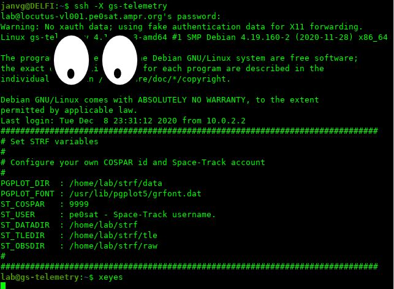

# GS-telemetry (a Virtual Machine OVA)

### This system was built to support the SPOC cubesat team, but it can also be used by others to get familiar with software that is used by satellite reception enthusiasts.

Date: 05-12-2020 Version 1.0 (Initial release)\
Date: 06-12-2020 Version 1.1

Debian Buster/amd64 based Virtual Machine with the following software installed to run a satellite groundstation.

The Virtual machine is created on Virtualbox 6.1 and exported as an `Open Virtualization Format 1.0` the virtual disk is in vmdk format so VMware users should also be able to import the ova and run the Virtual Machine in there enviroment (this is not tested, please share your experience).

The details of the installation including useraccount information can be found in the Virtual machines General Description after the ova import.

- SatNOGS groundstation: Installed with the help of this Wiki: [https://wiki.satnogs.org/SatNOGS_Client_Ansible](https://wiki.satnogs.org/SatNOGS_Client_Ansible)
- GNURadio 3.8.2: This is part of the satnogs repository that is enabled by the `ansible install`
- GR-Satellites: Installed with the help of the following documentation: [https://gr-satellites.readthedocs.io/](https://gr-satellites.readthedocs.io/)
- strf: Installed with the information on [https://github.com/cbassa/strf](https://github.com/cbassa/strf)
- sattools: Installed with the information on [https://github.com/cbassa/sattools](https://github.com/cbassa/sattools)
- GQRX: Installed as a debian package `ii  gqrx-sdr 2.11.5-1+b2 amd64 Software defined radio receiver`
- SoundModem: It is possible with the help if wine32 to run the soundmodem software from UZ7HO [http://uz7.ho.ua/packetradio.htm](http://uz7.ho.ua/packetradio.htm)
- GetKISS+: It is possible with the help if wine32 to run the GetKISS+ software from DK3WN [https://www.satblog.info/software/](https://www.satblog.info/software/)

### Some basics on how to work with the VM

This VM comes with no graphical user interface (gui) for the application that do need one, like gnuradio-companion, you need to use another system as gui.\
A gui can be used on multiple operating system, like Windows, Linux, BSD, macOS, so what do you need for this:

- If you have a Linux based system with a gui present, the only thing you have to do is login to the VM with an ssh connecting and add the option `-X` after the connection is active you can run every gui based program and it will show its output on the system were you started the ssh connection.
- For a Windows operating system you need to install a so called X-server, I you [X410](https://x410.dev/) but you also use [VcXsrv](https://sourceforge.net/projects/vcxsrv/). When this is installed and active try to below example to see if it is working.

Here an example where the connection is made and the gui application xeyes is executed.

